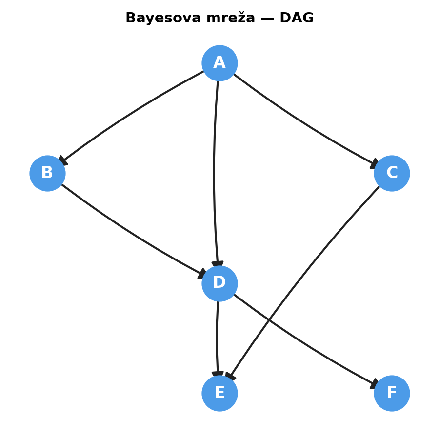
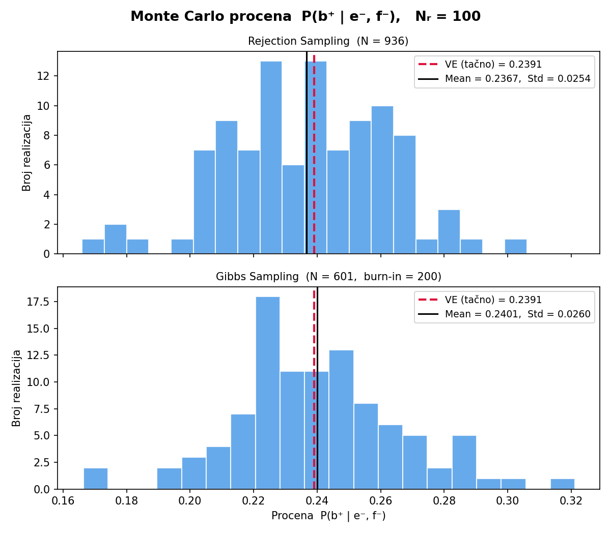
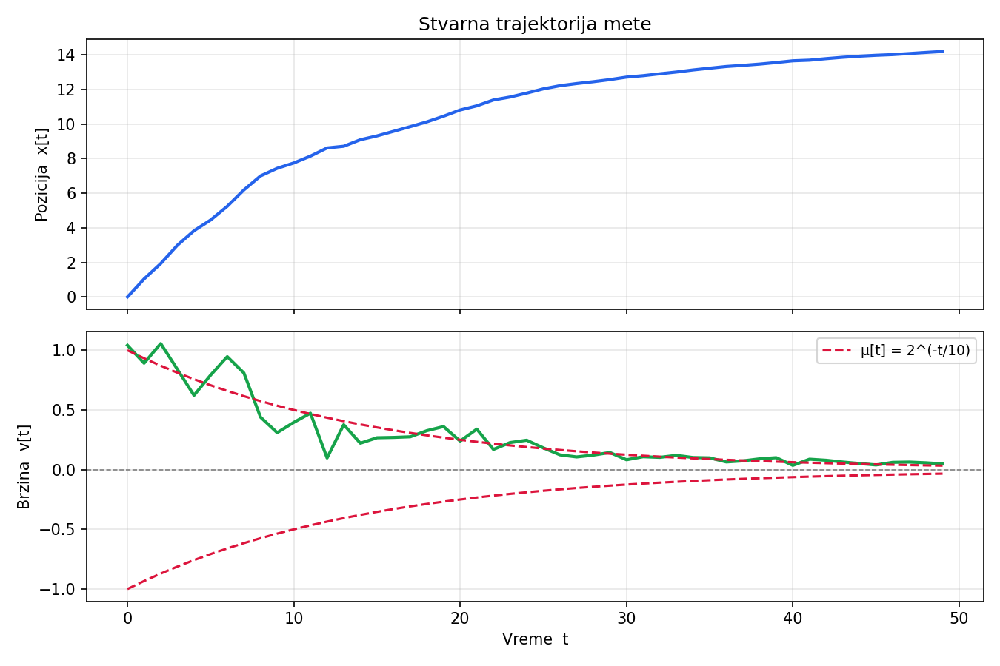
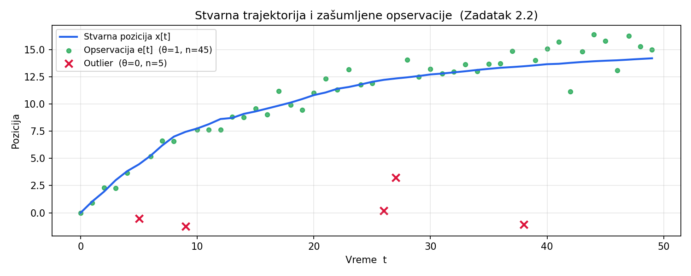
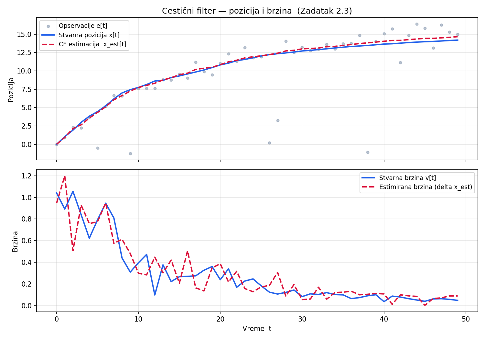
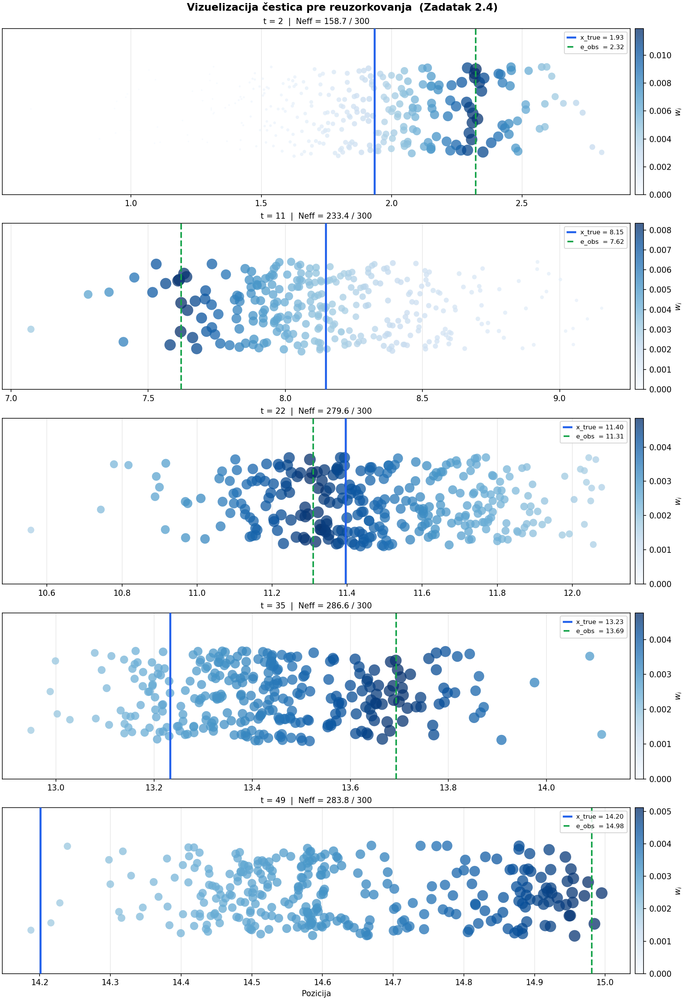
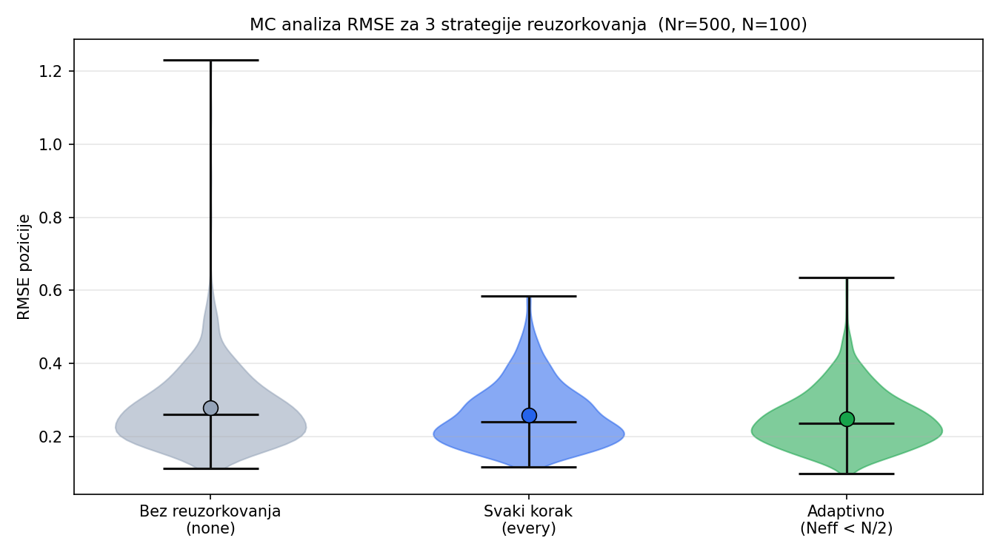

# Homework 2 — Bayesian Network Inference & Particle Filter Tracking

**Course:** 13E054VI — Artificial Intelligence, ETF Belgrade
**Code:** [`homework_2.py`](homework_2.py)

---

## Task 1 — Inference in a Bayesian Network

### Network structure (DAG)

```
A → B
A → C
A → D   (together with B)
B → D
C → E   (together with D)
D → E
D → F
```



### Conditional probability tables

| | | | | |
|---|---|---|---|---|
| $P(a^-) = 0.3$ | $P(b^-\mid a^-) = 0.3$ | $P(c^-\mid a^-) = 0.4$ | $P(d^-\mid a^-,b^-) = 0.1$ | $P(e^-\mid c^-,d^-) = 0.3$ |
| $P(a^+) = 0.7$ | $P(b^-\mid a^+) = 0.8$ | $P(c^-\mid a^+) = 0.6$ | $P(d^-\mid a^-,b^+) = 0.5$ | $P(e^-\mid c^-,d^+) = 0.8$ |
| | | | $P(d^-\mid a^+,b^-) = 0.2$ | $P(e^-\mid c^+,d^-) = 0.6$ |
| | | | $P(d^-\mid a^+,b^+) = 0.8$ | $P(e^-\mid c^+,d^+) = 0.6$ |

$P(f^-\mid d^-) = 0.2, \quad P(f^-\mid d^+) = 0.6$

### Query

Estimate $P(b^+ \mid e^-, f^-)$ using three methods:

1. **Variable Elimination** (exact) — elimination order $C \to A \to D$, chosen so that intermediate factors stay over the smallest possible domain.
2. **Rejection Sampling** — sample all variables in topological order, discard the sample if $E \neq e^-$ or $F \neq f^-$.
3. **Gibbs Sampling** — fix the evidence $E=e^-, F=f^-$, then cyclically resample $A, B, C, D$ from their full conditionals (Markov blanket).

For the two Monte Carlo methods, the sample size $N$ is chosen so both estimators reach the same target standard deviation ($\sigma_0 = 0.025$), then $N_r = 100$ independent repetitions are run and displayed as histograms.

### Results

| Method | Result | Sample size |
|---|---|---|
| **Variable Elimination** (exact) | $P(b^+\mid e^-,f^-) \approx 0.2391$ | — |
| Rejection Sampling | mean ≈ 0.2391, std ≈ 0.025 | $N = 936$ (≈291 accepted) |
| Gibbs Sampling | mean ≈ 0.2391, std ≈ 0.025 | $N = 422$ (burn-in = 200) |

$P(e^-,f^-) \approx 0.3113$, i.e. roughly one in three generated samples is accepted by rejection sampling — the acceptance rate that also sets $N_\mathrm{RS}$ analytically via $\sigma_\mathrm{RS} = \sqrt{p(1-p)/(P(e^-,f^-)\cdot N)}$. Gibbs sampling has no such closed form (the chain's samples are correlated), so its $N$ is calibrated empirically on a 300-sample pilot run.



Both estimators center on the exact value with the targeted spread; Gibbs sampling never discards a sample but pays for it in per-sample correlation, which is why its calibrated $N$ ends up smaller than the nominal rejection-sampling count would suggest.

---

## Task 2 — Particle Filter Tracking

### Motion model

$$x[t+1] = x[t] + v[t], \qquad x[0] = 0$$
$$v[t] \sim \mathcal{N}\!\left(\mu[t], \left(\tfrac{\mu[t]}{3}\right)^{2}\right), \qquad \mu[t] = 2^{-t/10}, \quad t = 0,\dots,49$$

The mean velocity decays exponentially — the target keeps decelerating — while the coefficient of variation stays constant at $1/3$.

### Measurement model

$$e[t] = \theta[t]\cdot x[t] + n[t], \qquad \theta[t] \sim \mathrm{Bernoulli}(0.9), \qquad n[t] \sim \mathrm{Laplace}\!\left(0, b(x[t])\right), \qquad b(x) = \frac{\sqrt{|x|}}{5}$$

With probability 0.1 the sensor produces a pure-noise outlier ($\theta = 0$); otherwise it reports the true position plus Laplace noise whose scale grows with distance. Marginalizing $\theta$ gives the mixture likelihood used by the filter:

$$p(e[t]\mid x[t]) = 0.9\cdot\mathrm{Lap}(e[t]-x[t];\,b) + 0.1\cdot\mathrm{Lap}(e[t];\,b)$$

### Particle filter

Each step: (1) update log-weights with the observation likelihood and normalize (log-sum-exp trick, needed since 50 successive small-probability multiplications would underflow in linear space), (2) estimate $\hat{x}[t] = \sum_i w_i x_i$, (3) resample according to the chosen strategy, (4) propagate particles through the motion model.

Three resampling strategies are compared:

| Strategy | Description |
|---|---|
| `none` | Never resample — weights accumulate for all 50 steps |
| `every` | Resample every step (multinomial) |
| `adaptive` | Resample only when $N_\mathrm{eff} = 1/\sum_i w_i^2 < N/2$ |

 

 

### Monte Carlo RMSE comparison ($N_r = 500$, $N = 100$ particles)



**No resampling** degenerates fastest — nearly all probability mass collapses onto one particle ($N_\mathrm{eff} \to 1$), giving the worst RMSE. **Resampling every step** prevents degeneracy but introduces *sample impoverishment* (repeated copies of the same particle reduce diversity), which shows up as intermediate RMSE. **Adaptive resampling** — intervening only when $N_\mathrm{eff} < N/2$ — gets the best of both and achieves the lowest RMSE and lowest variance of the three.

---

## Running

```
python src/homework_2/homework_2.py
```

Prints all numeric results to stdout and generates the plots referenced above (images and the compiled `report.pdf` are not committed — see the root [.gitignore](../../.gitignore); the official write-up `report.tex` is kept in Serbian, as required for course submission).

## Requirements

```
numpy
scipy
matplotlib
networkx
```

---

## License

This project is licensed under the [Apache License 2.0](../../LICENSE).
