# Homework 3 — Reinforcement Learning: Q-Value Iteration, Q-Learning & REINFORCE

**Course:** 13E053VI — Reinforcement Learning, ETF Belgrade
**Code:** [`homework_3.py`](homework_3.py)

---

## Environment

A stochastic **2×5 gridworld**:

```
        col1   col2   col3   col4   col5
row A    A1     A2     A3     A4     A5
row B   B1(-1)  B2    B3(+1)  B4   B5(-1)
```

- **Terminal states:** B1 (reward −1), B3 (+1), B5 (−1)
- **Non-terminal states:** A1–A5, B2, B4 — 7 in total
- **Actions:** up, down, left, right
- **Start state:** uniformly random among the 7 non-terminal states
- **Discount factor:** γ = 0.9 (default), γ = 0.999 (alternative)

When the agent picks an action it moves in the intended direction with probability **0.6**; otherwise it moves in one of the 3 remaining directions or stays in place, each with probability **0.1**. Hitting a wall keeps the agent in the same state. The per-step reward is **transitional** — it depends on the state reached, not the current state: +1 for B3, −1 for B1/B5, and a −0.04 "living cost" everywhere else, which pushes the agent toward short paths.

A shared `Simulator` exposes `reset()`/`step()` to all three algorithms, plus a `model()` method that exposes the transition distribution — used **only** by Q-value iteration, since Q-learning and REINFORCE must learn without access to the environment's model.

---

## Part 2 — Q-Value Iteration (benchmark)

Exact synchronous dynamic-programming solution over the known transition model:

$$Q_{t+1}(s,a) = \sum_{s'} P(s'\mid s,a)\left[R(s') + \gamma \max_{a'} Q_t(s',a')\right]$$

Converges to $Q^*$ because the Bellman operator is a γ-contraction. For γ = 0.9 this takes **53 iterations**; for γ = 0.999 (closer to 1, hence a slower contraction rate) it takes **66 iterations**.

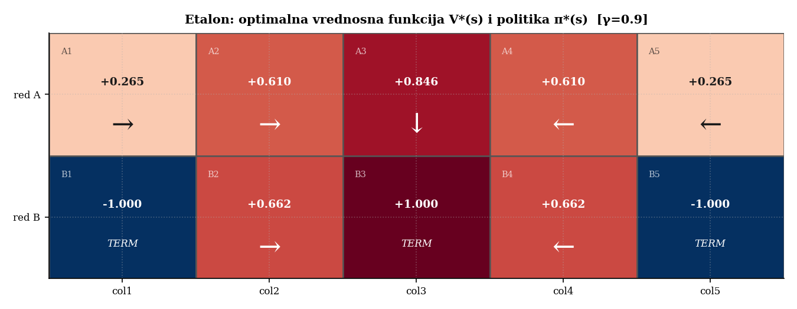

| State | A1 | A2 | A3 | A4 | A5 | B2 | B4 |
|---|---|---|---|---|---|---|---|
| $V^*(s)$ | +0.265 | +0.610 | +0.846 | +0.610 | +0.265 | +0.662 | +0.662 |
| $\pi^*(s)$ | right | right | down | left | left | right | left |

This benchmark ($V^*$, $\pi^*$) is what Q-learning and REINFORCE are validated against in every plot below.

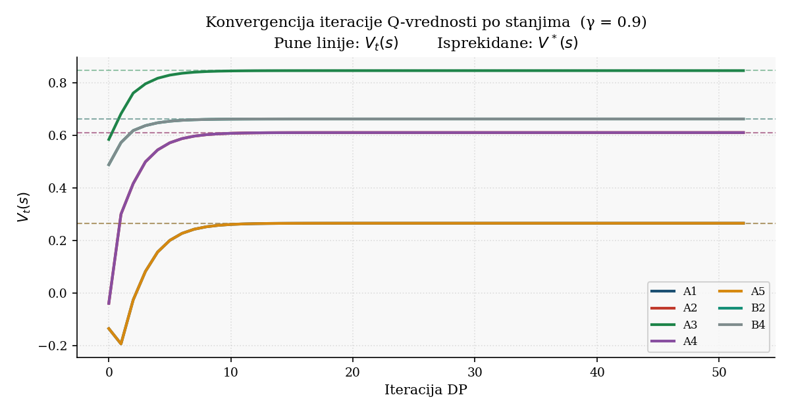

---

## Part 3 — Q-Learning (model-free, TD, ε-greedy)

Learns $Q(s,a)$ directly from `(s, a, r, s')` transitions, off-policy:

$$Q(s,a) \leftarrow Q(s,a) + \alpha\left[r + \gamma\max_{a'}Q(s',a') - Q(s,a)\right]$$

ε-greedy exploration selects a random action with probability ε, otherwise the greedy action (with random tie-breaking, since all Q-values start at 0).

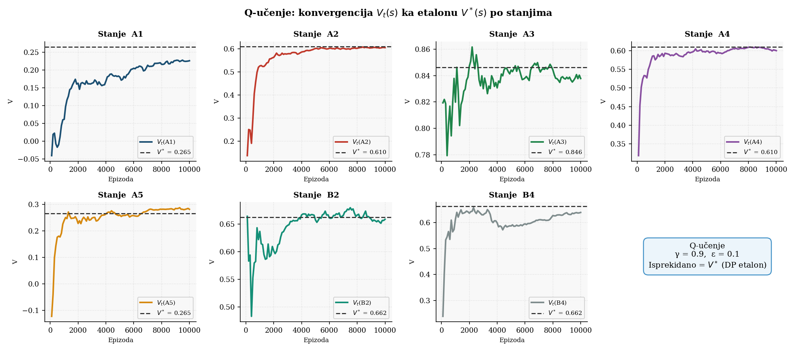

**Learning rate.** Robbins–Monro convergence requires $\sum\alpha_e = \infty$ and $\sum\alpha_e^2 < \infty$. The schedule $\alpha_e = \ln(e+1)/(e+1)$ satisfies both and converges to the exact value; a constant $\alpha$ satisfies only the first, so it learns fast but then oscillates around $Q^*$ with residual noise proportional to $\alpha$.

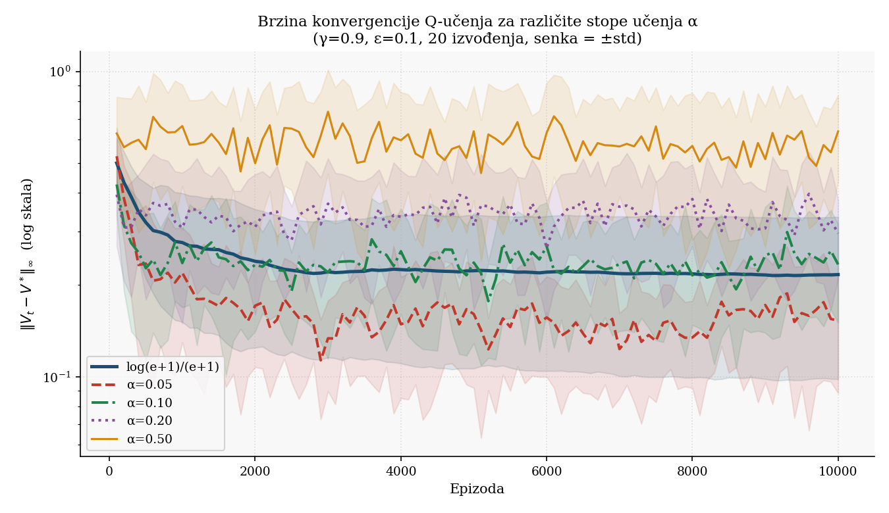

**Exploration rate.** Because `reset()` already samples the start state uniformly over all 7 non-terminal states, state coverage is guaranteed even with modest ε; here ε mainly determines whether alternative actions get tried in each state. ε = 0 under-explores and lags; ε ≈ 0.1 gives the fastest, lowest error curve; larger ε wastes steps on random moves.

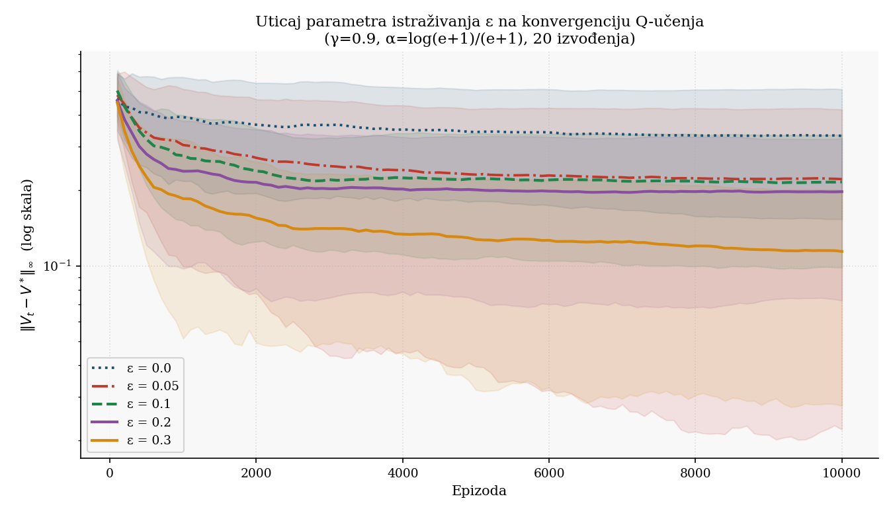

**Discount factor.** A greedy policy learned with γ = 0.9 (10,000 episodes) averages **+0.706** raw reward over 1000 test episodes, vs. **+0.655** for γ = 0.999 — the more far-sighted agent tolerates more living-cost steps to avoid risk, and also needs more episodes to converge (66 vs. 53 DP iterations for the same tolerance).

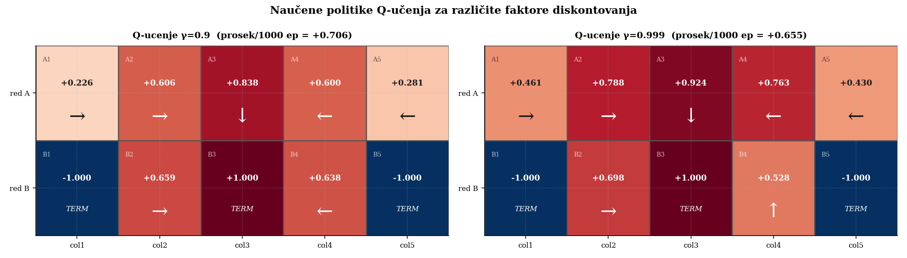

---

## Part 4 — REINFORCE (policy gradient, softmax)

Learns a stochastic policy directly, parametrized by 28 logits $\theta_{s,a}$ (7 non-terminal states × 4 actions):

$$\pi_\theta(a\mid s) = \frac{\exp(\theta_{s,a})}{\sum_{a'}\exp(\theta_{s,a'})}$$

Each episode is played out in full under the current policy, then parameters are updated using the **return-to-go** $v_\tau = r_\tau + \gamma v_{\tau+1}$ and the softmax score function:

$$\theta_{s_\tau,a'} \mathrel{+}= \alpha \cdot v_\tau \cdot \left(\mathbb{1}[a'=a_\tau] - \pi_\theta(a'\mid s_\tau)\right)$$

Being a pure Monte Carlo gradient estimate (no bootstrapping), REINFORCE is unbiased but high-variance — visible directly in the raw per-episode reward, which swings between roughly −1.5 and +1.0 even after thousands of episodes.

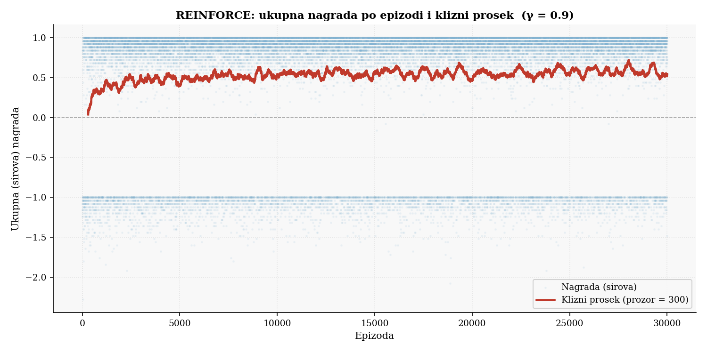

Over 30,000 episodes (γ = 0.9, α = ln(e+1)/(e+1)), the average reward rises from **+0.24** (first 1000 episodes) to **+0.57** (last 1000 episodes).

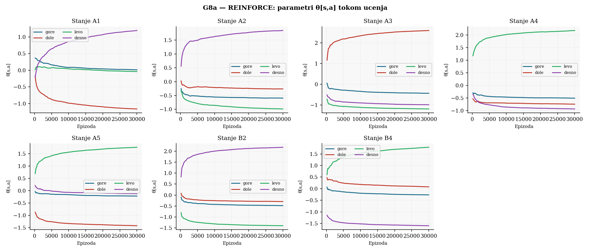 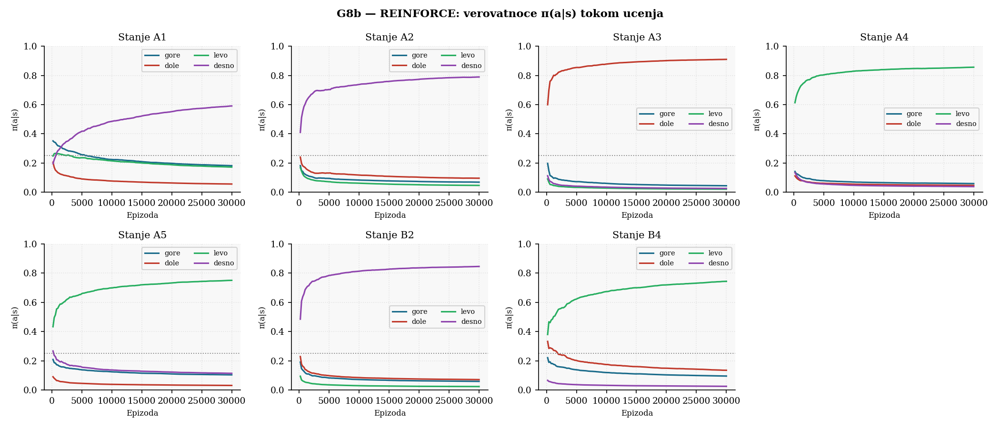

REINFORCE needs a **smaller** learning rate than Q-learning, since the return-to-go magnitude is typically larger than a single TD error; too large an α destabilizes the softmax logits.

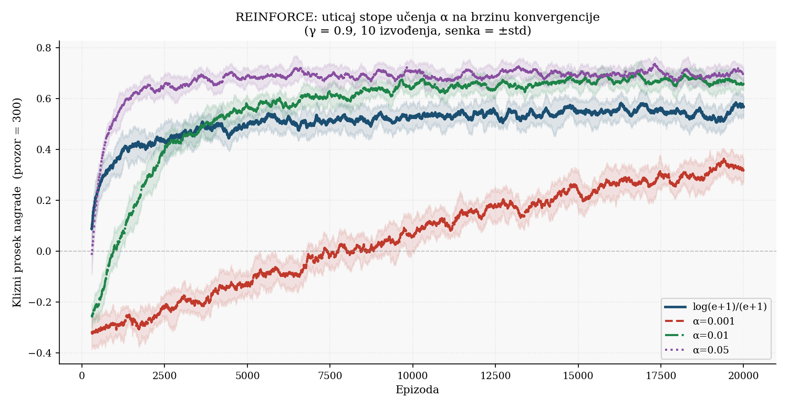

The final policy matches $\pi^*$ in **7 / 7 states**. State A3 (one step from the +1 terminal) reaches the highest confidence, $\pi(\text{down}\mid A3) = 91.9\%$; other states settle at 74–82%, since softmax never saturates to exactly 1.

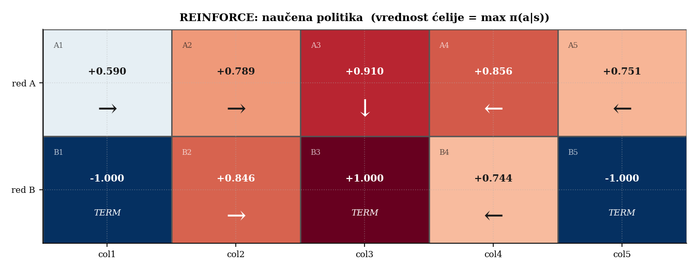

---

## Summary

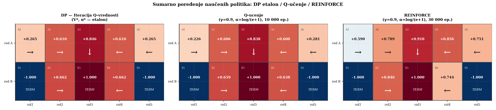

| | Q-value iteration | Q-learning | REINFORCE |
|---|---|---|---|
| Approach | Model-based (DP) | Model-free (TD) | Model-free (policy gradient) |
| Learns | $Q^*(s,a)$ exactly | $Q^*(s,a)$ approx. | $\pi_\theta(a\mid s)$ directly |
| Bias | None (exact) | Yes (bootstrapping) | None (Monte Carlo) |
| Variance | — | Low | High |
| Needed | 53 DP iterations | 10,000 episodes | 30,000 episodes |
| Policy | Deterministic | Deterministic | Stochastic |
| Matches $\pi^*$ | 7/7 (exact) | 7/7 | 7/7 |

All three methods converge to the same optimal policy: **right** in A1, A2, B2; **left** in A4, A5, B4; **down** in A3 — a symmetric policy reflecting the environment's symmetric layout and reward structure.

---

## Running

```
python src/homework_3/homework_3.py
```

Runs all four parts, prints the numeric results above to stdout, and regenerates every plot (`plots/G1…G11`, `~3–5` minutes total — the multi-seed learning-rate/epsilon sweeps dominate the runtime). Plots and the compiled `report.pdf` are not committed — see the root [.gitignore](../../.gitignore); the official write-up `report.tex` is kept in Serbian, as required for course submission.

## Requirements

```
numpy
matplotlib
```

---

## License

This project is licensed under the [Apache License 2.0](../../LICENSE).
